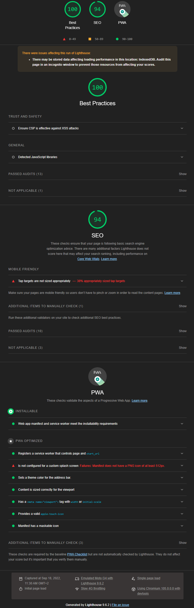
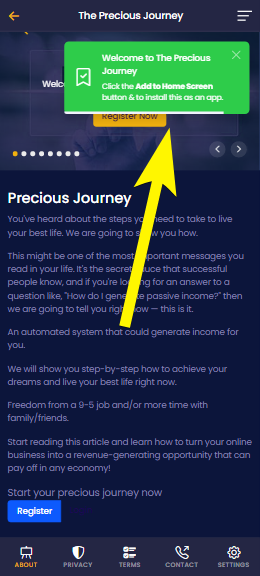
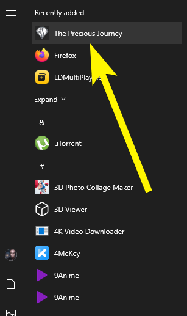
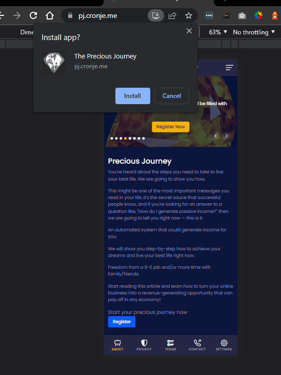

# Precious Journey PWA App

## Links

- [Framework Used](./docs/koa.md)
- [Node Modules Used](./docs/README.md)
- [About the Service Worker](./docs/sw.md)
- [Download the Android App](https://pj.cronje.me/app-release-signed.apk)
- [Detailed list of updates](https://github.com/charlpcronje/pj.pwa.tests/commits/main)

## App Under Development

Because the app is still under development, it is not yet published to the app store, so when you install the app it will warn you that the app is from an `unknown source`, This is normal. Below is instructions to get past that limitation while the app is still under development and not yet published on in the app store.

- [Installing an App from Unknown Sources (Youtube)](https://www.youtube.com/watch?v=BtVXF4isN3g)
- [Installing an App from Unknown Sources (Document)](https://www.maketecheasier.com/install-apps-from-unknown-sources-android/)

## Some Stats from Lighthouse (Google's way of giving the app a score)

## PWA Is Installable

